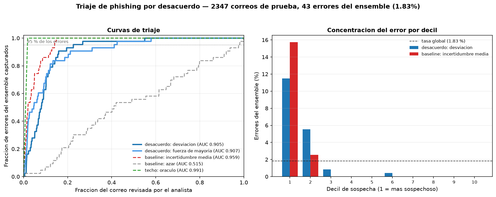

# Triaje de phishing por desacuerdo entre clasificadores

[](https://github.com/eduolihez/phishing-triage/actions/workflows/ci.yml)
[](LICENSE)
[](requirements.txt)
[](requirements.txt)

**Un analista no puede revisar todo el correo que marca un clasificador. ¿Puede
el desacuerdo entre varios clasificadores decirle cuál revisar primero?**

Este repositorio mide esa pregunta sobre 7.822 correos reales. La respuesta que
sale de los datos **no es la que esperaba**, y ese es el resultado más
interesante del trabajo.



---

## El resultado en una línea

> El desacuerdo entre clasificadores **funciona** para priorizar la revisión
> (AUC 0,905 frente a 0,515 del azar), pero **pierde claramente** contra una
> señal mucho más simple: la incertidumbre media del propio ensemble
> (AUC 0,959).

Para capturar el 95 % de los errores del ensemble hay que revisar:

| Señal de prioridad | AUC de triaje | Correo a revisar |
|---|---|---|
| Oráculo (techo teórico) | 0,991 | 1,75 % |
| **Incertidumbre media** (baseline) | **0,959** | **14,10 %** |
| Desacuerdo: desviación | 0,905 | 22,62 % |
| Desacuerdo: fuerza de mayoría | 0,907 | 41,20 % |
| Azar (suelo) | 0,515 | 97,66 % |

Si sólo quieres el titular práctico: **revisando el 14 % del correo se cazan 19
de cada 20 errores**, y para eso no hace falta ensemble — basta con mirar
dónde el modelo no está seguro.

## Por qué esperaba lo contrario

La idea viene de dos sitios:

- Los [modelos de verificación del BSC para catalán](https://huggingface.co/BSC-LT/catalan-verification-model-pkt-a),
  que entrenan dos copias del mismo ASR con **mitades disjuntas** del corpus
  para que sus errores no estén correlacionados. Si ambos transcriben igual, la
  transcripción es fiable.
- Un [estudio de 2026 sobre transcripción médica](https://www.frontiersin.org/journals/artificial-intelligence/articles/10.3389/frai.2026.1829902/full)
  que usa el desacuerdo entre 8 ASR como señal *sin referencia* para decidir qué
  revisa un humano: recupera el 93,7 % de los errores revisando el 28,6 % del
  texto.

La estructura del problema en un SOC es idéntica: sin verdad de referencia, con
revisión humana cara y escasa. Parecía trasladable. Los números dicen que aquí
no lo es.

## La explicación que proponen los datos

El ensemble tiene cuatro vistas del mismo correo, y **no son igual de fuertes**:

| Vista | Qué mira | Exactitud | AUC |
|---|---|---|---|
| `remitente` | Cabeceras semánticas: quién dice ser | 93,86 % | 0,985 |
| `urls` | Adónde llevan los enlaces | 94,38 % | 0,986 |
| `estructura` | Cómo está construido el HTML | 95,14 % | 0,980 |
| **`texto`** | **Qué dice el mensaje (TF-IDF)** | **98,17 %** | **0,998** |
| *Ensemble* | *Media de las cuatro* | *98,17 %* | *0,999* |

**La vista de texto sola iguala al ensemble entero.** Cuando un miembro es muy
superior al resto, el "desacuerdo" deja de medir duda genuina y pasa a medir
*que los débiles se equivocan* — algo que no informa sobre si el ensemble
acierta.

Ahí está la diferencia con el montaje del BSC: sus dos modelos tienen WER casi
idéntico (3,85 % y 3,74 %). Fuerzas equiparadas por diseño. Ésa parece ser la
condición que hace útil al desacuerdo, y es una condición que aquí no se cumple.

**Hipótesis para el siguiente experimento**: repetir esto con cuatro modelos de
la *misma* familia entrenados sobre particiones disjuntas del corpus —
replicando el método del BSC en vez de sólo su intuición— y comprobar si el
desacuerdo remonta al equiparar fuerzas.

## El sesgo temporal, y por qué no invalida el resultado

Los corpus públicos de phishing tienen un problema que la literatura arrastra y
casi nunca declara: **el correo legítimo y el phishing vienen de épocas
distintas**.

| Clase | Origen | Volumen | Época |
|---|---|---|---|
| Phishing | Nazario `phishing0-3.mbox` | 4.572 | 2004-2007 (87 %) |
| Legítimo | SpamAssassin `easy_ham` + `hard_ham` | 2.750 | 2002 (100 %) |
| Spam | SpamAssassin `spam` | 500 | 2002 |

Un clasificador puede acertar reconociendo el **año** y no el phishing. Por eso
`experimentos/02_control_epoca.py` mide explícitamente cuánto vale ese atajo:

| Prueba | Resultado | Interpretación |
|---|---|---|
| Clasificar usando **sólo el año** | 99,74 % exactitud | El atajo existe y es casi perfecto |
| Evaluar sólo en la franja solapada (≤2004) | 98,31 %, AUC 1,000 | **El modelo no lo está usando**: aguanta dentro de la misma época |
| ¿El texto lleva marca de época? | AUC 0,943 | El atajo está disponible en el vocabulario |

La segunda fila es la que salva el experimento: al restringir la evaluación a
correos de la misma época, el rendimiento **no cae**. Con la cautela de que esa
franja sólo contiene 31 phishing, así que la evidencia es indicativa, no
concluyente.

Medidas tomadas para no facilitar el atajo:

- **Se descartan todas las cabeceras de transporte** (`Received`, `X-Mailer`,
  `Message-ID`, versiones MIME) en `scripts/construir_dataset.py`. Sólo se
  conservan las semánticas: `From`, `Reply-To`, `Return-Path`, `To`, `Subject`.
- `hard_ham` se incluye a propósito: son correos legítimos que *parecen* spam
  (promociones, HTML recargado). Sin ellos el problema sería artificialmente
  fácil.
- El spam cuenta como "no phishing", obligando a distinguir correo molesto de
  correo que roba credenciales.

## Las cuatro vistas

La decorrelación de errores se busca dando a cada clasificador **una parte
distinta del correo**, sin acceso a las demás:

```
correo
  ├── remitente    From / Reply-To / Return-Path / To / Subject
  ├── urls         URLs del cuerpo y hrefs del HTML
  ├── texto        asunto + texto visible  (TF-IDF + regresión logística)
  └── estructura   formularios, campos password, iframes, imágenes, ratios
```

Un phishing con dominio limpio engaña a la vista de `urls`, pero la de
`estructura` le ve el formulario de contraseña. Ése es el complemento que
justifica el montaje — aunque, como muestran los resultados, no basta para que
el desacuerdo supere a la incertidumbre.

## Reproducir

Sin GPU. Unos minutos en un portátil.

```bash
git clone https://github.com/eduolihez/phishing-triage.git
cd phishing-triage
pip install -r requirements.txt

python scripts/descargar_corpus.py      # descarga Nazario + SpamAssassin
python scripts/construir_dataset.py     # -> datos/corpus.jsonl
python experimentos/01_triaje.py        # resultado principal
python experimentos/02_control_epoca.py # control de sesgo temporal
python experimentos/03_grafica.py       # -> resultados/triaje.png
```

Los datos **no se versionan**: son de terceros y el script los descarga de sus
fuentes originales, imprimiendo las huellas SHA-256 para poder comprobar que
son los mismos.

## Limitaciones

Lo que este trabajo **no** demuestra:

- **No dice que el desacuerdo sea inútil.** Dice que pierde contra un baseline
  más simple *en este montaje*, con vistas de fuerza desigual y sobre un corpus
  fácil (98,2 % de exactitud, sólo 43 errores en la partición de prueba).
- **Pocos errores que estudiar.** Con 43 fallos, las curvas de triaje son
  ruidosas. Un corpus más difícil daría una medición más firme.
- **Corpus antiguo.** El phishing de 2004-2007 no se parece al de hoy: no hay
  HTTPS generalizado, ni acortadores, ni typosquatting de dominios modernos.
  Las conclusiones sobre *método* deberían aguantar; las cifras absolutas no
  son extrapolables.
- **Sin validación cruzada.** Una única partición 70/30 con semilla fija. Los
  intervalos de confianza vendrían de repetir con varias semillas.
- **`hard_ham` son sólo 250 correos**, así que el caso difícil está
  infrarrepresentado.

## Fuentes de datos

- [Nazario Phishing Corpus](https://monkey.org/~jose/phishing/) — José Nazario.
- [SpamAssassin Public Corpus](https://spamassassin.apache.org/old/publiccorpus/) — Apache SpamAssassin.

TREC-07 y CEAS-08 habrían sido mejores como correo legítimo, por ser de 2007 y
coincidir en el tiempo con el phishing. Ambos están hoy caídos (404 en
`plg.uwaterloo.ca`) y su licencia prohibía redistribuir cualquier porción.

## Licencia

[MIT](LICENSE). Los corpus son de sus respectivos autores y no se redistribuyen
aquí.
